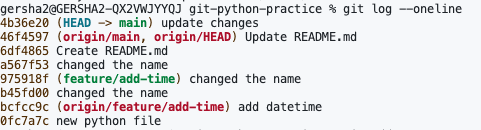
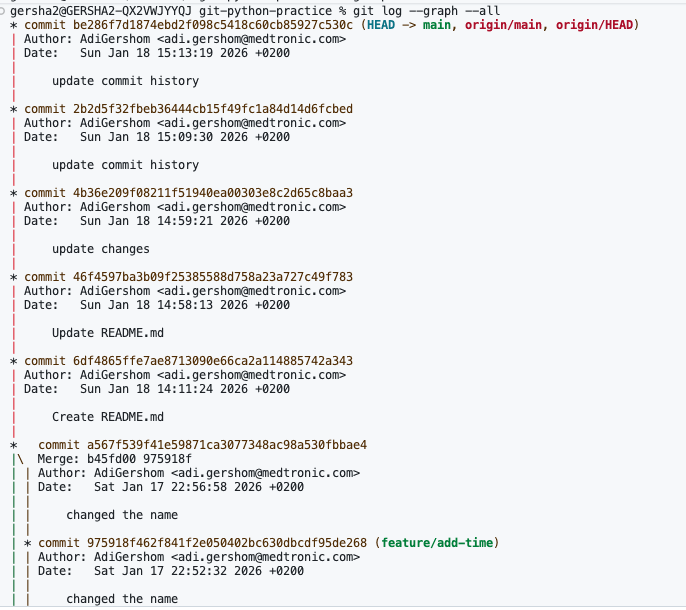
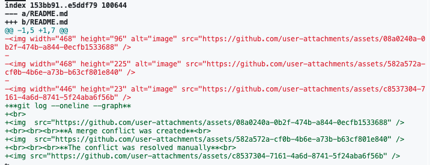
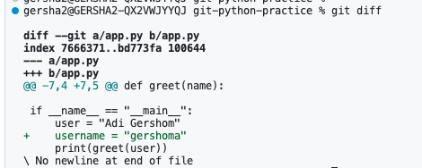
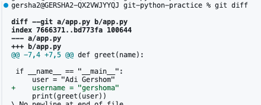

**git log --oneline --graph**

   **A merge conflict was created** 

   **The conflict was resolved manually** 

   **Bonus Git Assignment – Hands-On Advanced Practice** 
**git log --oneline** 

 **git log --graph --all** 

 **git show 46f4597** 

 **git diff** 

 **git status after restore app.py** 

