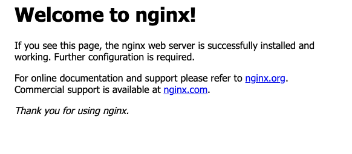

 ## Part 1 – Setup Minikube
gersha2@GERSHA2-QX2VWJYYQJ git-python-practice % kubectl version --client
minikube version

Client Version: v1.34.1
Kustomize Version: v5.7.1
minikube version: v1.35.0
## Part 2 – Start & Explore the Cluster
gersha2@GERSHA2-QX2VWJYYQJ git-python-practice % minikube start
😄  minikube v1.35.0 on Darwin 15.7.2 (arm64)
✨  Using the docker driver based on existing profile
👍  Starting "minikube" primary control-plane node in "minikube" cluster
🚜  Pulling base image v0.0.46 ...
🔄  Restarting existing docker container for "minikube" ...
❗  Failing to connect to https://registry.k8s.io/ from inside the minikube container
💡  To pull new external images, you may need to configure a proxy: https://minikube.sigs.k8s.io/docs/reference/networking/proxy/
🐳  Preparing Kubernetes v1.32.0 on Docker 27.4.1 ...
🔎  Verifying Kubernetes components...
    ▪ Using image gcr.io/k8s-minikube/storage-provisioner:v5
🌟  Enabled addons: storage-provisioner, default-storageclass

❗  /Applications/Docker.app/Contents/Resources/bin/kubectl is version 1.34.1, which may have incompatibilities with Kubernetes 1.32.0.
    ▪ Want kubectl v1.32.0? Try 'minikube kubectl -- get pods -A'
🏄  Done! kubectl is now configured to use "minikube" cluster and "default" namespace by default
gersha2@GERSHA2-QX2VWJYYQJ git-python-practice % `minikube status`
minikube
type: Control Plane
host: Running
kubelet: Running
apiserver: Running
kubeconfig: Configured

gersha2@GERSHA2-QX2VWJYYQJ git-python-practice % `kubectl cluster-info`       

Kubernetes control plane is running at https://127.0.0.1:55674
CoreDNS is running at https://127.0.0.1:55674/api/v1/namespaces/kube-system/services/kube-dns:dns/proxy

To further debug and diagnose cluster problems, use kubectl cluster-info dump.

gersha2@GERSHA2-QX2VWJYYQJ git-python-practice % `kubectl get nodes`

NAME       STATUS   ROLES           AGE    VERSION
minikube   Ready    control-plane   326d   v1.32.0

gersha2@GERSHA2-QX2VWJYYQJ git-python-practice % `kubectl get namespaces`

NAME              STATUS   AGE
default           Active   326d
kube-node-lease   Active   326d
kube-public       Active   326d
kube-system       Active   326d

gersha2@GERSHA2-QX2VWJYYQJ git-python-practice % `kubectl get pods -n kube-system` 
NAME                               READY   STATUS    RESTARTS      AGE
coredns-668d6bf9bc-cpjl9           1/1     Running   3 (28m ago)   326d
etcd-minikube                      1/1     Running   3 (28m ago)   326d
kube-apiserver-minikube            1/1     Running   3 (28m ago)   326d
kube-controller-manager-minikube   1/1     Running   3 (28m ago)   326d
kube-proxy-6frns                   1/1     Running   3 (28m ago)   326d
kube-scheduler-minikube            1/1     Running   3 (28m ago)   326d
storage-provisioner                1/1     Running   7 (27m ago)   326d

## Part 3 – Explore Services
gersha2@GERSHA2-QX2VWJYYQJ git-python-practice % `kubectl get services -A`
NAMESPACE     NAME         TYPE        CLUSTER-IP   EXTERNAL-IP   PORT(S)                  AGE
default       kubernetes   ClusterIP   10.96.0.1    <none>        443/TCP                  326d
kube-system   kube-dns     ClusterIP   10.96.0.10   <none>        53/UDP,53/TCP,9153/TCP   326d

`Kubermetes Service:`
Provides a stable way to access Pods.
Pods can chage but a service gives a fixed IP and DNS so applications can communicate reliably
4 main services:
-clusterIP - internal IP in the cluster (default)
-NodePort- exposes the service on static port to access it from outside
-LoadBalancer- create an extrnal load balancer to distibute traffic to pods
-ExternalName- maps the service to an external DNS name outside the cluster

## Part 4 – Deploy the Applications
gersha2@GERSHA2-QX2VWJYYQJ k8s % `kubectl apply -f .`
deployment.apps/backend created
service/backend created
deployment.apps/frontend created
service/frontend created

gersha2@GERSHA2-QX2VWJYYQJ k8s % `ubectl get pods -o wide`                      

NAME                             READY   STATUS    RESTARTS       AGE     IP            NODE       NOMINATED NODE   READINESS GATES
backend-d48c54465-mmqzq          1/1     Running   0              62m     10.244.0.10   minikube   <none>           <none>
frontend-746dfb8759-jvxv7        1/1     Running   0              62m     10.244.0.9    minikube   <none>           <none>
hello-minikube-ffcbb5874-8cjv4   1/1     Running   2 (3h5m ago)   5d17h   10.244.0.7    minikube   <none>           <none>

## Part 6 – Access the Application
gersha2@GERSHA2-QX2VWJYYQJ k8s % minikube service frontend

| NAMESPACE |   NAME   | TARGET PORT |            URL            |
|-----------|----------|-------------|---------------------------|
| default   | frontend |          80 | http://192.168.49.2:31192 |
|-----------|----------|-------------|---------------------------|
🏃  Starting tunnel for service frontend.
|-----------|----------|-------------|------------------------|
| NAMESPACE |   NAME   | TARGET PORT |          URL           |
|-----------|----------|-------------|------------------------|
| default   | frontend |             | http://127.0.0.1:59434 |
|-----------|----------|-------------|------------------------|

🎉  Opening service default/frontend in default browser...
❗  Because you are using a Docker driver on darwin, the terminal needs to be open to run it.

## Part 7 – Inspect Resources

gersha2@GERSHA2-QX2VWJYYQJ k8s % `kubectl logs frontend-746dfb8759-jvxv7`
/docker-entrypoint.sh: /docker-entrypoint.d/ is not empty, will attempt to perform configuration
/docker-entrypoint.sh: Looking for shell scripts in /docker-entrypoint.d/
/docker-entrypoint.sh: Launching /docker-entrypoint.d/10-listen-on-ipv6-by-default.sh
10-listen-on-ipv6-by-default.sh: info: Getting the checksum of /etc/nginx/conf.d/default.conf
10-listen-on-ipv6-by-default.sh: info: Enabled listen on IPv6 in /etc/nginx/conf.d/default.conf
/docker-entrypoint.sh: Sourcing /docker-entrypoint.d/15-local-resolvers.envsh
/docker-entrypoint.sh: Launching /docker-entrypoint.d/20-envsubst-on-templates.sh
/docker-entrypoint.sh: Launching /docker-entrypoint.d/30-tune-worker-processes.sh
/docker-entrypoint.sh: Configuration complete; ready for start up
2026/01/25 11:55:06 [notice] 1#1: using the "epoll" event method
2026/01/25 11:55:06 [notice] 1#1: nginx/1.29.4
2026/01/25 11:55:06 [notice] 1#1: built by gcc 15.2.0 (Alpine 15.2.0) 
2026/01/25 11:55:06 [notice] 1#1: OS: Linux 6.12.54-linuxkit
2026/01/25 11:55:06 [notice] 1#1: getrlimit(RLIMIT_NOFILE): 1048576:1048576
2026/01/25 11:55:06 [notice] 1#1: start worker processes
2026/01/25 11:55:06 [notice] 1#1: start worker process 30
2026/01/25 11:55:06 [notice] 1#1: start worker process 31
2026/01/25 11:55:06 [notice] 1#1: start worker process 32
2026/01/25 11:55:06 [notice] 1#1: start worker process 33
2026/01/25 11:55:06 [notice] 1#1: start worker process 34
2026/01/25 11:55:06 [notice] 1#1: start worker process 35
2026/01/25 11:55:06 [notice] 1#1: start worker process 36
2026/01/25 11:55:06 [notice] 1#1: start worker process 37
10.244.0.1 - - [25/Jan/2026:13:06:08 +0000] "GET / HTTP/1.1" 200 615 "-" "Mozilla/5.0 (Macintosh; Intel Mac OS X 10_15_7) AppleWebKit/537.36 (KHTML, like Gecko) Chrome/144.0.0.0 Safari/537.36" "-"
10.244.0.1 - - [25/Jan/2026:13:06:08 +0000] "GET /favicon.ico HTTP/1.1" 404 555 "http://127.0.0.1:59434/" "Mozilla/5.0 (Macintosh; Intel Mac OS X 10_15_7) AppleWebKit/537.36 (KHTML, like Gecko) Chrome/144.0.0.0 Safari/537.36" "-"
2026/01/25 13:06:08 [error] 30#30: *1 open() "/usr/share/nginx/html/favicon.ico" failed (2: No such file or directory), client: 10.244.0.1, server: localhost, request: "GET /favicon.ico HTTP/1.1", host: "127.0.0.1:59434", referrer: "http://127.0.0.1:59434/"
## Part 8 – Undeploy the Applications
gersha2@GERSHA2-QX2VWJYYQJ k8s % `kubectl delete -f .`
deployment.apps "backend" deleted from default namespace
service "backend" deleted from default namespace
deployment.apps "frontend" deleted from default namespace
service "frontend" deleted from default namespace

## Part 9 – Verify Cleanup
gersha2@GERSHA2-QX2VWJYYQJ k8s % `kubectl get pods `  

NAME                             READY   STATUS    RESTARTS        AGE
hello-minikube-ffcbb5874-8cjv4   1/1     Running   2 (4h59m ago)   5d19h

gersha2@GERSHA2-QX2VWJYYQJ k8s % kubectl get deployments
NAME             READY   UP-TO-DATE   AVAILABLE   AGE
hello-minikube   1/1     1            1           5d19h

gersha2@GERSHA2-QX2VWJYYQJ k8s % `kubectl get services`
NAME         TYPE        CLUSTER-IP   EXTERNAL-IP   PORT(S)   AGE
kubernetes   ClusterIP   10.96.0.1    <none>        443/TCP   326d

